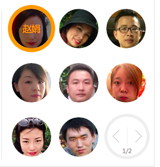

# 现有开发模式思考
2014年11月24日，苏宁V购二期项目发布生产，没有重大问题，过程比较顺利。经过V购项目的开发，我经历了一个完整的项目开发流程，V购项目的开发方式和苏宁的大多数项目相同。因此基于这个项目的一些思考和总结有一定的普遍适用性。

## 现有开发流程概述
V购项目的开发大致遵循以下流程：  
1. 项目立项，需求评审，产品文档，交互设计，视觉设计。这些都是在开发阶段直接的流程，在这些流程中，开发可以参与并提出自己的一些建议，但是不强制。一般情况下开发人员不会全部参与。  
2. 后台开发人员根据项目需求进行后台开发，包括接口开发。与此同时，前端开发开始进行静态页面的开发，还原视觉稿。  
3. 前端开发完成后，由产品，交互，视觉等对前端稿进行评审，修改其中的问题。  
4. 进入前台开发阶段。一般情况下，前台代码由开发完成，新建一个JavaScript文件，不直接修改前端JS，前端协助开发。前台开发主要围绕数据层的交互进行，将静态页赋予数据逻辑，成为实际可用的网页。  
5. 测试人员给出测试用例，并进行测试需求评审。评审通过后，一旦前台开发完成，即进入测试阶段。  
6. 测试人员严格按照测试用例进行测试，对发现的问题进行跟踪，并发起问题跟踪单，交由相应的开发人员进行bug修复并回测。所有的测试均在测试环境(sit/pre)上进行。测试人员定期向项目组全体成员以及上级领导发送测试报告，反馈测试进度。  
7. 所有测试完成并通过后项目封板，将所有需发布文件打包交由运维在预定的时间进行发布，将所有需发布资源发布至生产环境。  
8. 发布至生产环境后确认没有问题，开放入口，正式投入使用。至此，项目开发流程结束。

## 现有开发方式的问题
### 需求评审阶段
一些需求对于前端开发来说是不方便实现的，这些方面要尽量避免。例如下面的模块，是首页的一部分：  
  
每个圆的外边框宽度为8px，而视觉稿中，两个圆之间的距离只有15px，这样都无法用CSS3或遮罩层直接实现，都要借助于JS的控制，而对于这么一个简单的效果用上JS是完全没有必要的，最后只有将圆之间的距离改为16px才得以解决。  
所以在需求评审，尤其是交互视觉评审阶段，前端尽量要参与。上述问题可能过于细致不一定能看出来，但是一些比较明显的问题尽量可以在前期就避免掉。  

### 前端开发阶段
#### 前端代码库管理
目前新的代码管理方式是先使用Fas构建项目目录，所有的开发全部在codeDev目录下。同时，同时通过每个目录下gruntfile.js中的配置，使用grunt将所有的代码打到codePub目录下，codePub目录是前端与开发对接的目录，开发从此目录中获取代码，再复制到自己的开发目录下进行开发。使用的代码版本管理工具是SVN。  
