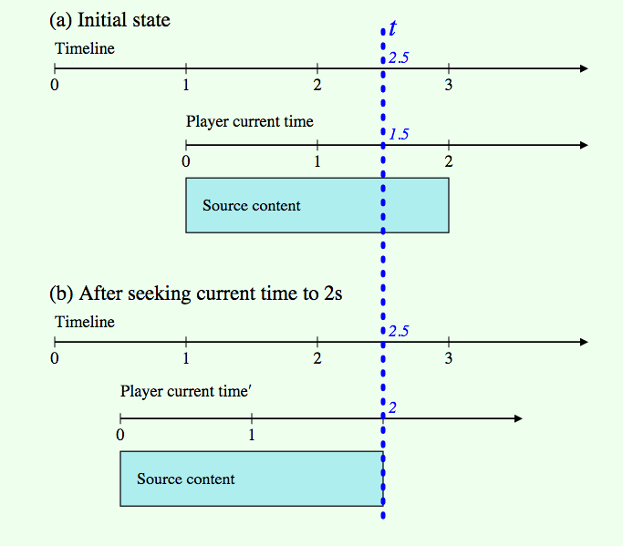
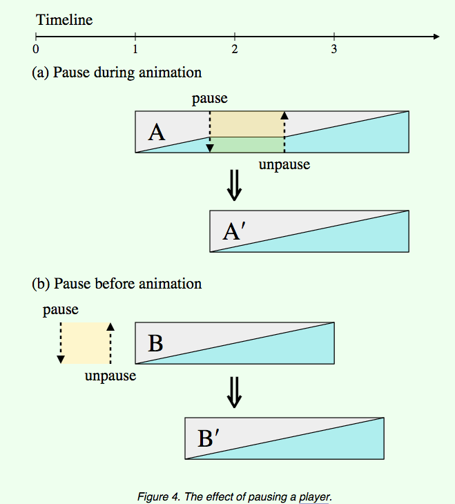
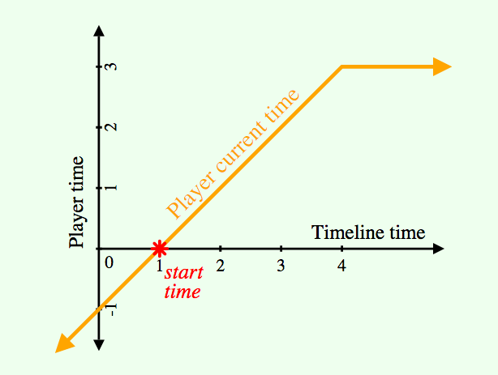

网页中的动画早就不是什么稀奇的东西了，一直以来，网页动画的实现方式也在不断变化与改进。受浏览器自身功能限制，网页动画的发展在初期并不顺利，很多的实现方式并不**人性化**。好在如今，随着web技术的不断发展，动画在页面交互中发挥的作用越来越大，W3C也开始正视这个问题，开始将一套真正用于实现动画效果的API的规范制定提上了日程。

在进入主题之前，先梳理一下过去，包括现在，在实现动画的方式上所使用的一些主流方法。通过回顾这些**血泪史**，才能更加体会到规范实现的意义有多么重大。

**GIF图**  
这种实现方式实际上都不能算是网页动画的范畴，因为图片必须事先制作好，要根据特定的网页交互效果进行调整是很不方便的，同时它也不能相应用户的操作。所以它的用途主要还是在于页面的装饰。在Web 1.0时代，网页中大量充斥了各种花里胡哨的GIF图片充当的装饰元素，如水平分割线，鼠标跟随装饰等。小学时用Frontpage拖表格做网页的年代，GIF图片是给网页加分的神器。

**Flash**  
Flash刚出现的时候是非常高大上的动画解决方案，主流浏览器的支持相当到位，最重要的是它真正实现了动画对操作的相应。不仅是交互，各种Flash游戏，Flash动画短片也如雨后春笋一般涌出。还记得当年大明湖畔的《东北人都是活雷锋》吗？正是借了Flash动画的东风，才红遍大江南北（无意暴露年龄了）。Flash制作在那个时候也是非常洋气的职业。

不过归根到底，以上两种方式还不能算是网页动画，只是把网页当做载体，插入了真正实现动画的外来元素。不过随着技术的发展，尤其是CSS技术的不断进步，真正意义上的网页动画出现了。

**CSS**  
在CSS2时代，伪类的使用实现了最简单的网页动画效果，如`:hover`, `:focus`这样的伪类。虽然这再基础不过，但是毕竟是不依赖于任何内嵌的外来元素的动画实现，所以还是值得一提。

**JavaScript**  
所谓动画，本质的实现方式就是每秒超过一定帧数的静态画面的连贯显示，借由人脑的视觉暂留远离，给人一种动作感的视错觉。那么通过JavaScript的API，以一定的速度不断修改元素的样式，自然可以达到动画的效果。又由于JavaScript对元素的控制在时序上比CSS更加方便准确，所以用JS实现动画已经成为了现在大多数网页动画的主流，不仅jQuery这样的库实现了易用的动画API，还有很多对动画支持更好的，性能更高的JS库不断涌现。相关信息可以看我的[另一篇译文](https://github.com/classicemi/blog/issues/3)。

**JavaScript + CSS + Image**  
纯用JS的话，所实现的动画也仅仅是不断地改变元素的样式，这种层面的动画对于网页交互效果的实现来说的确是够了，但和真正的动画相比，还是显得比较简单，或者说两者已经是不同的动画实现方向了。要实现真正意义上的动画，还是通过web技术回归动画的本质，将一系列仅有细微差别的图片高频率地闪现以实现动画。Sprite技术便是其中的典型代表。
实现Sprite动画，在没有CSS支持的情况下，需要编写很多JS代码去控制图片的显示。有了CSS3的`animation keyframes`的支持，仅靠CSS代码就能实现不错的动画效果了。

**will-change**  
可能有人主观上会觉得CSS动画属性的性能一定比JS的性能要高，实际上并非如此，CSS的`transition`和`animation`并不是什么底层的封装，其性能和JS的动画实现是差不多的，只是简化了实现方式而已。而CSS新引入的`will-change`属性则不同，它的原理是告诉浏览器元素的什么属性将会应用动画效果，让浏览器提前做好准备进行优化，调用计算机的GPU资源单独对这部分属性进行渲染，而GPU的图形性能是要更高的。当然，页面性能的提高伴随着的也是更高的系统资源开销，所以不是什么属性都值得用上`will-change`的。

## Web Animations
絮絮叨叨说了上面这么多，网页动画主要的实现方式也说得差不多了，下面就要进入主题了。点进上文译文链接并看到最后的童鞋应该会发现，在那篇文章的最后，提到了一个W3C的新的动画API规范——Web Animations。它的出现，我认为意义还是比较重大的，它表明动画的实现已经被W3C组织正式提上日程，有了规范的API，至少我们可以期待动画底层实现的性能可以得到不断的优化。

在说Web Animation的API之前，有一些基础概念需要了解一下，所有的API实际上都是在这些概念的基础上进行设计的。

### 两种模型
Web Animations由两方面组成，分别是时间模型(Timing Model)和动画模型(Animation Model)，两个模型不是独立的，而是相互影响的

#### 时间模型
在Web Animations中，时间可以被理解为分层的，彼此独立的，在一个页面中会有多个时间模型的存在，而不是像`Date().getTime()`这样是全局通用的，父节点的时间值也可以传递给子节点。有意思的是，这里的**时间值**虽然同样是以毫秒表示，它可以表示从某一时刻计算的毫秒数。而这个时间值和真实世界的时间(wall-clock milliseconds)之间的关系可以由中间所有时间变换累积而成。

**全局时钟(The gobal clock)**  
前面提到，时间模型是分层的，它的底部便是全局时钟。它不会受系统时间的影响，而是由一个不确定的时间点算起到现在的一个以毫秒为单位的绝对值。这个起始点并不重要，重要的是时钟变化的速率。和`Date().getTime()`不同的时，全局时钟的值是不能直接获取的，什么时候全局时钟的时间值开始计算，就把这个时刻当做全局时钟的零点。至于这个开始时间点以什么时刻为准，不同设备的标准都是不一样的，这同样也是不重要的。

**时间线(Timelines)**  
时间线便是以全局时钟的零点为基准，每个时刻测量的时间偏移绝对值的集合。每个页面文档都有各自的一条时间线，称为**文档时间线**。文档时间线相对全局时钟有一个固定的偏移，时间值也是单调递增的，如果时间线没有比例变换的话，时间值和现实时间的增长也是一致的。

**Players**  
这是规范中用的词，找不到合适的翻译，就直接使用了。每个player都包含一个单独的动画节点，player将动画节点和时间线联系起来。每个player也有自己的起始时间，它的起始时间就是时间线上的某一点。同时，每个player也有自己的序号，这个序号是player被创建时就确定的，它的作用是用于解析每个player在各种动画状态下的排列顺序。

player的当前时间(current time)的计算公式为：
```
当前时间 = (当前时间线时间 - 起始时间) * 播放速率
```
如果有一个暂停时间(hold time)存在的话，当前时间将会等于暂停时间。  

对于player，可以对其进行三种行为，分别是seeking, pausing和limiting。  
首先是seeking：  
顾名思义，它是一个寻址的操作，寻什么址，寻的就是当前player的播放位置，这个操作可以使当前动画的播放位置任意前进，后退，简单来说，就是改变player的当前时间位置。下面就是seeking操作的示意图：

可以看到，seeking操作不会对当前的timeline造成任何影响，而是让player相对于timeline移动位置。  

然后是pausing：  
对于动画来说，pausing的作用一方面是暂停，另一方面是影响动画的开始时间，先来看示意图：

可以看到，对于动画A来说，中间暂停的时间使得动画的实际开始时间后移。如果在pausing后又有seeking操作的话，动画的所有时间点将会全部更新。

最后是limiting:  
limiting的字面意思是限制，不过限制的是什么呢，先来看图：

图中，timeline是横轴而player time是纵轴，展现了player时间和实际timeline时间的相对关系，其中最重要的两个时间点是player current time和timeline的交点start time以及player time结束的拐点。在拐点之后，即使timeline的时间值仍在增加，player的时间值也不再变化了。  
那么所谓的limiting，即是如果seeking当前时间点到player的结束时间之后，比如说5s的位置，实际的current time是不会增加的，而动画对象的表现也好像是暂停了一样，这个current time的位置被限制住了。反之也是一样，start time之前的时间点也是不能被seek到的。

说了一些基本概念，接着说就无聊了，先来看一个demo，这样可以对API有一个直观的认识：

